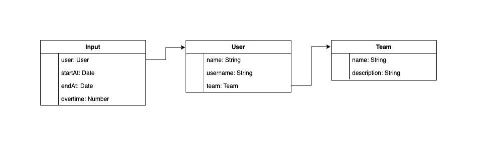

# Node.js scaffold

## Introduction

Backend of a time tracker application for employees of a company. In this MVP, you can input hours of work per day and see statistics of hours worked and overtime hours for each user.

## Context

The first thing was to use as a scaffold my personal [repository of scaffolding for Node.js](https://github.com/alopezsanchez/nodejs-scaffold), which contains the basic configuration to start working with Node.js and not lose time. It contains the following:

- [nvm](https://github.com/nvm-sh/nvm) integration
- [ESLint](http://eslint.org/) + [Prettier](https://prettier.io/) configuration
- [EditorConfig](http://editorconfig.org/) integration
- [husky](https://github.com/typicode/husky) and [lint-staged](https://github.com/okonet/lint-staged) configuration

This backend is based on a [hexagonal architecture](https://netflixtechblog.com/ready-for-changes-with-hexagonal-architecture-b315ec967749) applied to Node.js and using SOLID principles whenever possible.


### Data model



### Tech stack

- [Node.js](https://nodejs.org/)
- [Express](http://expressjs.com/)
- [MongoDB](https://www.mongodb.com/) with [Mongoose](http://mongoosejs.com/)
- [Docker](https://www.docker.com/)

## Installation and configuration

### Prerequisites

- [Node.js](https://nodejs.org/en/) v14.17.0 or later
- [Docker](https://www.docker.com/) and [Docker Compose](https://docs.docker.com/compose/)

### Container execution

The recommendation is to execute the containers with [`docker-compose`](https://docs.docker.com/compose/) to deploy both server and `MongoDB` instances:

```bash
$ docker-compose build
$ docker-compose up
```

### Installation

```bash
$ npm i
```

### Configuration

There is a configuration management by environment (based on the environment variable `NODE_ENV`). There are several environments:

- `default` (for development)
- `production`
- `docker` (container deployment)

### Execution

```bash
$ npm start
```

### Tests

```bash
$ npm t
```
